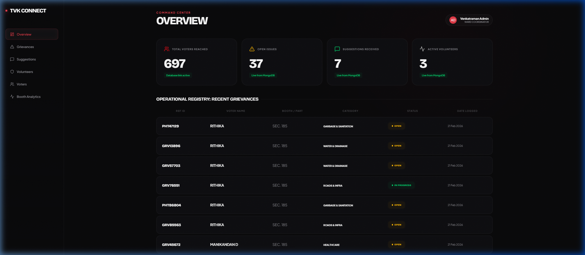

# TVK Connect 2.0 | Vanguard Command Center



## 🎭 The Vision
TVK Connect 2.0 is a high-impact political command center designed for the **Modern Political Vanguard**. It transforms standard administrative data into a cinematic, production-grade interface that empowers ward coordinators with live community intelligence.

## 🚀 Key Features
- **Cinematic Command Center**: Built with a "Modern Vanguard" aesthetic—obsidian themes, kinetic micro-animations, and high-impact typography.
* **Live Community Intelligence**: Real-time tracking of voter sentiment, grievances, and volunteer deployment via MongoDB integration.
* **Bento Analytics**: An asymmetric grid layout for optimized data visualization.
* **Operational Strips**: Actionable grievance tracking with interactive status control.
* **Cross-Platform Integration**: Integrated with WhatsApp Business API for direct community engagement.

## 🛠 Tech Stack
- **Frontend**: React (Vite), Framer Motion, Axios, Lucide Icons.
- **Backend**: FastAPI (Python), Motor (Async MongoDB), Uvicorn.
- **Database**: MongoDB Atlas.
- **Communication**: WhatsApp Business API.
- **Deployment**: Vercel (Frontend) & Render (Backend + Docker).

## 📂 Project Structure
```text
TVK 2.0/
├── frontend/          # React SPA with Vanguard Design System
├── backend/           # FastAPI Service & Bot Logic
├── docs/assets/      # Project Documentation Assets
└── render.yaml       # Infrastructure as Code for Render.com
```

## 🏗 Setup & Installation

### Backend
1. Navigate to `/backend`.
2. Install dependencies: `pip install -r requirements.txt`.
3. Configure your `.env` following the provided template.
4. Run locally: `python main.py`.

### Frontend
1. Navigate to `/frontend`.
2. Install dependencies: `npm install`.
3. Configure `VITE_API_BASE` in `.env`.
4. Run locally: `npm run dev`.

## 📍 Deployment
- **Frontend**: Optimized for Vercel. Includes `vercel.json` for SPA routing.
- **Backend**: Containerized with Docker and ready for Render.com via `render.yaml` blueprint.

---
*Designed & Built for the TVK Kavundampalayam Team.*
