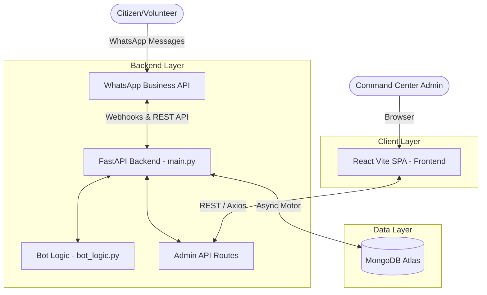
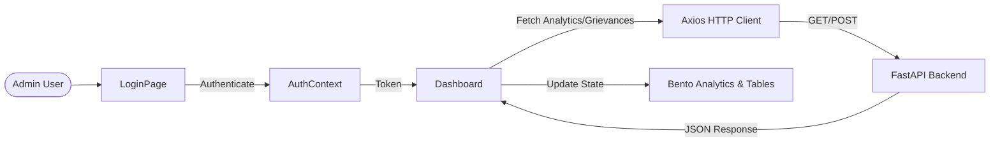
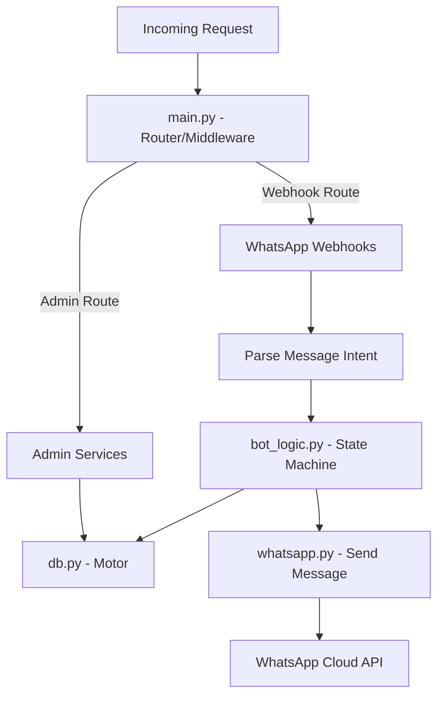
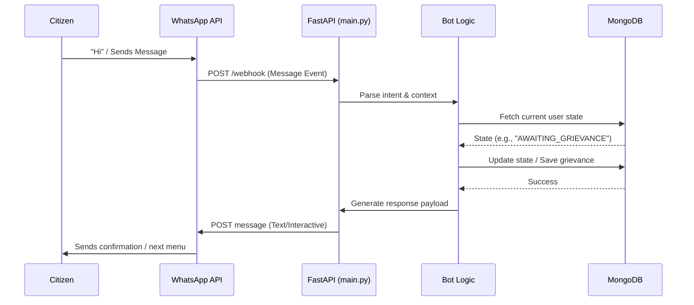
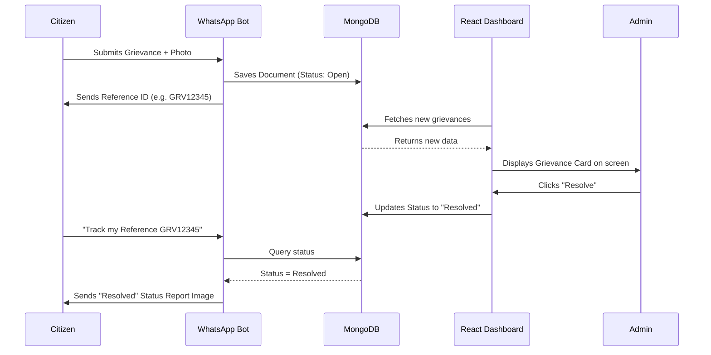
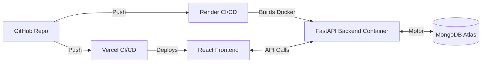

# TVK Connect 2.0 - System Architecture

This document provides a comprehensive overview of the system architecture for **TVK Connect 2.0**, a high-impact political command center and WhatsApp bot integration designed for real-time community intelligence.

---

## 1. High-Level Architecture Flow

TVK Connect 2.0 follows a modern decoupled architecture. The diagram below illustrates the high-level data flow and interactions between the frontend, backend, database, and external integrations.

---

## 2. Component Architecture

### 2.1. Frontend Architecture
The frontend is built with **React** and bundled using **Vite** for fast development and optimized production builds.

*   **Core Technologies:** React (v19), React Router (v7), Axios, Lucide React, SweetAlert2.
*   **Key Files:**
    *   `src/App.jsx`: Root component and routing.
    *   `src/AuthContext.jsx`: Authentication state.
    *   `src/Dashboard.jsx`: Vanguard Command Center interface (Bento Analytics grid).
    *   `src/LoginPage.jsx`: Secure entry point.

#### Frontend Data Flow Diagram

### 2.2. Backend Architecture
The backend is a robust asynchronous REST API and Bot Handler built on **FastAPI**.

*   **Core Technologies:** FastAPI, Uvicorn, Motor (MongoDB async), Pydantic, Requests.
*   **Key Modules:**
    *   `main.py`: Entry point, API routes, Webhooks.
    *   `bot_logic.py`: WhatsApp bot conversational state machine.
    *   `whatsapp.py`: WhatsApp Cloud API integration.
    *   `db.py`: MongoDB connection management.

#### Backend Flow Architecture

### 2.3. Data Layer
*   **Database:** MongoDB Atlas.
*   **Driver:** `motor` for non-blocking database operations.
*   **Collections:** Users/Members, Grievances, Operations, Analytics.

---

## 3. WhatsApp Bot Architecture and Website Integration

The WhatsApp bot is the primary user interface for citizens and volunteers. It acts as an automated data collection agent that feeds directly into the Command Center website (Dashboard).

### 3.1. Full Bot Capabilities & Flows
The bot (`bot_logic.py`) handles complex conversational state machines for the following tasks:
1. **Voter Verification:** Authenticates users by matching their EPIC number (Voter ID) against the `voters_collection`. Unverified users are captured as guests pending approval.
2. **Grievance Reporting (FLOW1):** Citizens can report local issues by categorizing them (e.g., Water, Roads), providing text descriptions, uploading photos, and sharing live locations. Generates a unique `GRV` Reference ID and saves to `grievances_col`.
3. **Ideas & Suggestions (FLOW2):** Collects feedback and saves them with a `SUG` Reference ID into `member_requests_col`.
4. **Volunteer Registration (FLOW3):** Allows users to sign up for roles like "Booth Volunteer" or "Organise Meetings" (`VOL` Reference ID).
5. **Booth Pulse Polling (FLOW7):** A live voting system to capture the most pressing issue in a specific booth. Features a 30-minute cooldown and live result generation sent back as an image.
6. **Activity Tracking & Summary:** Users can track their grievance status using their Reference ID, or get an "Engagement Summary" detailing how many issues they have raised, resolved, and their volunteer status.
7. **Ward Connect & Networks:** Automatically links voters to their local Ward Coordinator by extracting their assigned booth number.

#### Internal Bot Sequence Diagram

### 3.2. Integration with the Command Center (Frontend Website)
The data collected by the bot does not sit idle; it is instantly pushed to the React SPA Dashboard used by Admins.

*   **Real-Time Data Sync:** Whenever the bot writes to MongoDB via the async `Motor` driver, the React frontend pulls this data via REST APIs to populate the **Bento Analytics** grid.
*   **Operational Strips (Grievance Tracking):** The frontend displays a live feed of all `GRV` and `PHT` (Photo Evidence) submissions. Admins can view the photos, locations, and descriptions submitted via WhatsApp.
*   **Status Control:** When an Admin on the website updates a grievance status from `Open` to `In Progress` or `Resolved`, the next time the citizen uses the bot to "Track My Issue", the bot queries the DB and reflects the Admin's change immediately.
*   **Booth Pulse Analytics:** The live voting done via the bot (`FLOW7`) populates the data visualization charts on the website's dashboard, giving Admins a bird's-eye view of constituency-wide concerns.

#### WhatsApp to Website Flow

---

## 4. Infrastructure & Deployment

*   **Frontend Deployment (Vercel):** Single Page Application, environment variables point to production API.
*   **Backend Deployment (Render):** Containerized via Docker (`Dockerfile`), configured with `render.yaml`.
*   **Data Layer:** Cloud-hosted MongoDB Atlas.

